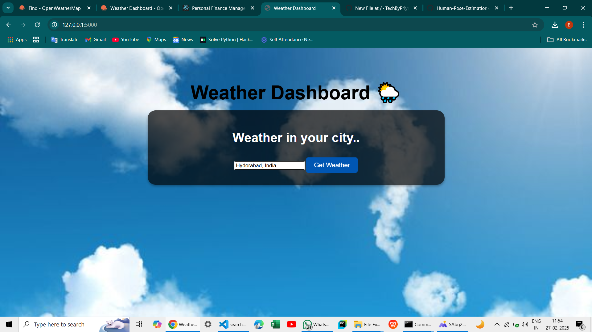
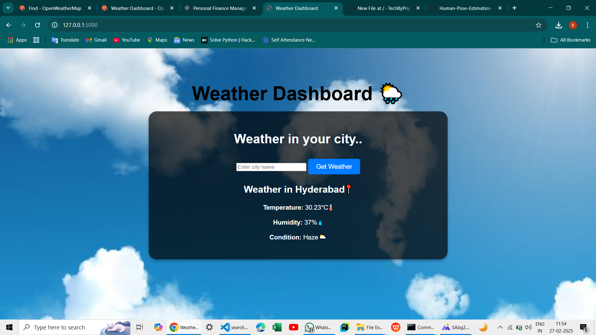

# Weather Dashboard Web Application

## Project Description
The **Weather Dashboard** is a web application developed using **Python Flask** that allows users to enter a city name and view real-time weather information. The app fetches weather details from the **OpenWeatherMap API** and displays the following information:
- Temperature 🌡️
- Humidity 💧
- Weather Condition ☁️

The application provides an interactive and user-friendly interface with a transparent container layout and background image.

## Features
- User can enter any city name to check the current weather details.
- Real-time weather data fetched from the **OpenWeatherMap API**.
- Displays temperature, humidity, and weather conditions.
- Attractive UI design with transparent container and background image.
- Error message displayed for invalid city names.

## Technologies Used
- Python
- Flask
- HTML
- CSS
- OpenWeatherMap API

## Project Structure
```
├── app.py                # Main Flask Application
├── templates
│   └── index.html        # HTML Template for UI
└── static
    ├── style.css         # CSS File for Styling
    └── images
        └── backgroung.jpg  # Backgroung Image   
```

## Installation and Setup
1. Clone the repository:
```bash
 git clone https://github.com/your-repo/Weather-Dashboard.git
```
2. Install required dependencies:
```bash
pip install flask requests
```
3. Run the application:
```bash
python app.py
```
4. Open your browser and navigate to:
```
http://localhost:5000
```

## API Integration
- **OpenWeatherMap API** is used to fetch real-time weather data.
- Replace `YOUR_API_KEY` in the **app.py** file with your own API key from OpenWeatherMap.

## How to Use
1. Enter the city name in the input box.
2. Click on **Get Weather** button.
3. View the temperature, humidity, and weather conditions displayed below.

## Screenshot



## Future Enhancements
- Add weather forecast for the next 5 days.
- Implement location-based weather detection.
- Display additional weather details like wind speed and pressure.

## Author
- Priyanka Balla
- ballapriyanka13@gmail.com
- https://github.com/TechByPriyanka

## License
This project is licensed under the **MIT License**.

